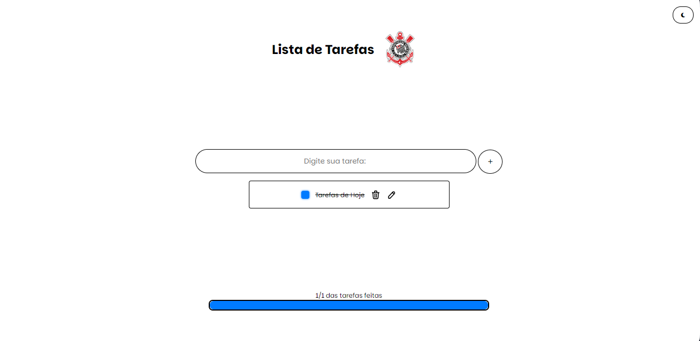

# To-Do-List
### Descrição
Esse repositório serve para fazer a tarefa da aula de Desenvolvimento Web, esse projeto é uma aplicação web simples para gerenciar listas de tarefas.

### Tecnologias Utilizadas:
* **HTML:** Estrutura da página.
* **CSS:** Estilização da página.
* **JAVASCRIPT:** Lógica da página.
* **FONTES:**
    * **W3Schools**
    * **MDN Web Docs**
    * **Gemini**
    * **ChatGPT**
    * **Copilot**

### Funcionalidades:
* Criar novas tarefas
* Editar tarefas existentes
* Marcar tarefas como concluídas
* Excluir tarefas

### Foto da página:

### Estruturas de Arquivos:
* **toDo.html:** Arquivo para aplicação.
* **toDo.css:** Estilo na aplicação.
* **responsividade.css:** Responsividade para outros dispositivos.
* **toDo.js:** Lógica na aplicação.
* **codigoComentado.js:** Comentários da código.

### Atualizações Futuras:
**Implementação de um servidor na nuvem (AWS), envolvendo um banco de dados NoSQL (MongoDB), como tópicos otimização de consultas, backup das tarefas e dos alunos e a segurança**

### Repositório do Projeto:
https://github.com/vitorbertolla/Trabalho_DW

### Feito por:
- Hiago Gimenez
- Vitor Bertolla